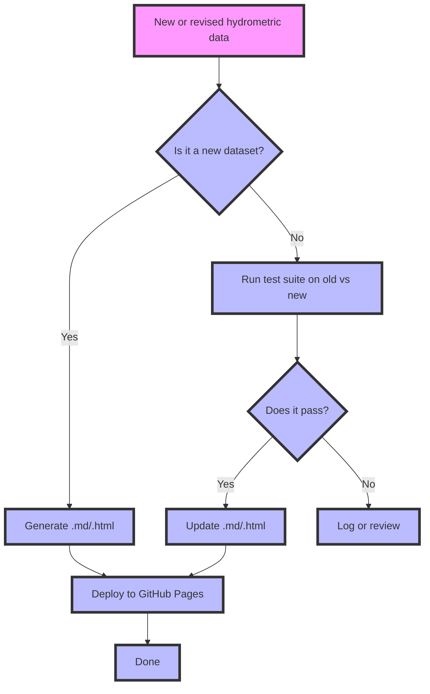

# Camel Farrier: Version Control for Hydrometric Data

```{note}
> **Note for developers:**
> Functional requirements and automation details for workflows are documented in [WORKFLOW_REQUIREMENTS.md](./WORKFLOW_REQUIREMENTS.md).
```

## Overview
- **Problem**: The lack of standardized version control for hydrometric data leads to inconsistencies and difficulties in data management.
- **Goals**: Implement a version control framework for hydrometric data to improve data quality, consistency, and accessibility.
- **In scope**: Water level data, discharge measurements, stage-discharge rating curves, benchmark surveys, cross-section surveys, catchment polygons, and associated metadata.
- **Out of scope**: Non-hydrometric data and external data sources.
- **Users and roles**: Data managers, hydrologists, and researchers.
- **Success criteria**: Improved data quality, user satisfaction, and increased collaboration among stakeholders.

## Data and Domain
- **Entities**: Streamflow monitoring stations, catchment polygons, and associated metadata.
- **Schemas and samples**: Standardized data formats for hydrometric data.
- **Volumes**: Large-scale hydrometric datasets from national monitoring networks (i.e. HYDAT).
- **IDs and naming**: Unique identifiers for each streamflow monitoring station (e.g., Official_ID).

## Workflows
- **HYDAT ingest**: Automated process for ingesting and processing HYDAT data into the version control system. A custom Python script `main_setup_runner.py` generates individual markdown pages from a template `book/docs/templates/station_page_template.md.j2` for each station in HYDAT.  A central index page with search functionality is created following the initial ingest of data.
- **Documentation builds**: Workflow for building and deploying documentation updates using Jupyter Book and hosted by Github Pages.
- **Hard-copy → curated**: Workflow for digitizing and curating hard-copy data sources.
- **User submissions**: Process for users to open discussions to determine if an issue should be opened based on defined criteria for data revision, or if the information justifies a pull request to add new data or revise existing data in the repository.
- **Rating curve updates**: Workflow for updating rating curves based on new data or revisions.
- **Datum adjustments and overrides**: Process for handling adjustments to vertical datums and other reference systems.
- **Preconditions / postconditions**: Conditions that must be met before and after each workflow step to ensure data integrity and quality and to inform development of automated tests carried out by Pytest.

## Rules and Validations
- **Organization standards**: Define the criteria for data quality, consistency, and completeness.
- **Physical checks**: Validate the geometric and spatial properties of catchment polygons.
- **QA flags**: Implement quality assurance flags to identify potential issues in the data.
- **Provenance fields**: Capture metadata about the origin and history of each data object.

## Repo and Git Model

### Repository Structure

This repository supports version-controlled updates to catchment boundaries using a standardized review process. Contributors can propose **new or revised catchment geometries** and automatically run spatial tests to validate their changes before integration.

| .           # Project root
├── book_docs/
|   └── _static/stations/
|       └── <official_id>_catchment_plot.html  # Auto-generated Bokeh plot for each catchment boundary -- this is required for the plot to be correctly embedded in the documentation.
|   └── stations/
│       └── HYDAT-<official_id>/                 # Example station folder
│           ├── <official_id>_attributes.csv     # Corresponding station metadata
│           ├── <official_id>_catchment.geojson  # Catchment boundary geometry file
│           ├── <official_id>_station.geojson    # Station location geometry file
│           ├── <official_id>_pour_point.geojson # Station location geometry file
│           └── <official_id>.md                 # Markdown page for the catchment.  This is automatically generated when the station is added, and automatically updated by Github actions workflows for continuous integration with web-facing quality documentation.
├── setup_scripts/                         # scripts for initializing the repository from `HYDAT.sqlite3`
├── templates/
│   ├── station_page_template_md.j2        # Jinja template for station pages
│   └── intro_content.md                   # Content for the introduction page of the accompanying Jupyter Book
├── data/
│   ├── watershed_boundaries/              # Catchment polygons from WSC
├── input_data/                            # Place new submissions here for validation
| tests.py                                 # Python test suite for validating catchment updates
---

- **File structure**: Standardized directory structure for organizing hydrometric data, including catchment polygons and metadata.
- **Branching**: Define a branching strategy (e.g., Git Flow) to manage feature development and releases.
- **Commit convention**: Establish a commit message convention (e.g., Conventional Commits) to ensure clear and consistent commit history.
- **Pull request (PR) checklist**: Create a template checklist for pull requests to ensure all necessary steps are completed before merging.
- **Data Owners**: Define responsibility of ownership for different parts of the repository to streamline code reviews and approvals.

## CI/CD and Testing

- **PR jobs**: Run tests and validations on pull requests to ensure code/metadata quality and data integrity.
- **Main branch jobs**: Execute comprehensive tests and deploy to staging/production environments.
- **Test categories**: Define unit tests, integration tests, and end-to-end tests for various components.
<!-- - CI artifacts: Store build artifacts, test results, and code coverage reports. -->
- **Deployment targets**: Define environments for deployment (e.g., staging, production) and automate the deployment process.

Tests are run using `pytest`, make sure you have `pytest` installed:

```bash
pip install pytest

Use the test runner script to validate the proposed catchment update:

```bash
python tests.py \
  --geojson input_data/new_geometry.geojson
```

```bash
pip install pytest

Use the test runner script to validate the proposed catchment update:

```bash
python tests.py \
  --geojson input_data/new_geometry.geojson
```

The test suite will check station geospatial data for the following:
- **Geometry Validity:** Ensure the geometry is valid..
- **Field Completeness:** Check that all required fields are present in the metadata.
- **New or existing monitoring station catchment polygon:**
  - If the `Official_ID` exists in the repository, it will compare the new geometry with the existing one.  The set of comparisons
  - If the `Official_ID` does not exist, it will throw an error as a station must exist to add data to.  Refer to station addition guidelines for more information.

A simple conceptual workflow for hydrometric data updates might look like this:


<!-- ```mermaid
            ┌─────────┐
            │ geojson │
            └───┬─────┘
                ▼
     ┌──────────────────────────┐
     │ validate required fields │
     └────┬─────────────────────┘
          ▼
┌───────> does Official_ID exist?
│            │
│         ┌──┴───┐
│         │ No   │─────────► generate .md + .html (new catchment)
│         └──────┘
│            |
│         ┌──────┐
│         │ Yes  │
│         └──┬───┘
│            ▼
│   run test suite on old vs new
│            │
│       Pass / Fail
│            │
│   (optional: log or review)
│            │
└────────► update .md/.html -->


## Interfaces
- **External sources/sinks**: Define external data sources and sinks for hydrometric data (e.g., APIs, databases).
- **APIs/CLIs**: Document APIs and command-line interfaces for interacting with the version control system.
- **Import/export formats**: Specify supported data formats for importing and exporting hydrometric data.

## Security and Compliance
- **Roles and access**: Define user roles and access controls for the version control system.
- **Secrets**: Implement secure storage and management of sensitive information (e.g., API keys, credentials).
- **Audit**: Establish auditing mechanisms to track changes and access to sensitive data.
- **License**: Define the licensing terms for the use and distribution of the repository.

## Non-Functional
- **Performance**: Define performance benchmarks and monitoring for the system.
- **Reliability**: Establish reliability requirements and monitoring for the system.
- **Portability**: Ensure the system can be easily deployed across different environments.

## Versioning and Releases
- **Code versioning**: Use semantic versioning (e.g., MAJOR.MINOR.PATCH) for code changes.
- **Data versioning**: Implement versioning for data schemas and formats.
- **Release cadence**: Define a regular release schedule (e.g., quarterly, biannually).
- **Migrations**: Plan and document data migrations between versions, and how and where plans will be developed and carried out.

## Acceptance Criteria
- **Scenario 1**: Initial data ingest: The system must successfully ingest new hydrometric data from HYDAT and store it in the appropriate format.
- **Scenario 2**: Archived data ingestion: The system must provide an alternative method of ingesting data from physical archive copies and ensure it is integrated consistently with existing datasets.
- **Scenario 3**: Internal or community contributions to data revisions: The system must support contributions from internal teams or the external community for revising and improving existing hydrometric data.

## Risks and Assumptions
- **Risks**: Potential data loss during migration, integration challenges with existing datasets, and varying data quality from different sources.
- **Assumptions**: All data sources are accessible and provide data in the expected formats, and contributors have the necessary permissions to make changes.

## Glossary
- **Hydrometric data**: Data related to the measurement of water flow, typically in rivers and streams.
- **Catchment**: The area of land where precipitation collects and drains into a common outlet, such as a river or lake.
- **Streamflow monitoring station**: A site equipped with instruments to measure and record water level in a river or stream.
- **Stage**: The height of the water surface above a reference point, typically the streambed, at a monitoring station.
- **Discharge measurement**: The process of quantifying the flow of water in a river or stream, typically expressed in cubic meters per second (m³/s).
- **Stage-discharge rating curve**: A graph that shows the relationship between the stage (water level) and discharge (flow) at a monitoring station.
- **Gauge Datum**: A reference point used to measure the stage of water in a river or stream, typically the streambed or a fixed point on the bank.
- **Benchmark Survey**: A survey that establishes a network of fixed points with known elevations to support hydrometric measurements.
- **Cross Section Survey**: A survey that measures the width and depth of a river or stream at specific points to assess its shape and flow characteristics.
- **Hydraulic control**: The natural channel geometry governing the relationship between water level and flow.
- **GeoJSON**: A format for encoding a variety of geographic data structures using JavaScript Object Notation (JSON).
- **Pull request**: A method of submitting contributions to a software project, typically involving a request to merge code changes from one branch into another.
- **Feature**: A spatial representation of a real-world object or phenomenon, typically consisting of a geometry and associated properties.


## Step-by-Step Guide: Create a new station object, add new features to test suites or workflows

To propose a change to any part of the WSC Hydrometric Dataset, follow these steps:

### 1. Create a new branch

Create a new branch to work on your new feature(s). This helps keep the main branch clean and allows for easier collaboration.

```bash
git checkout -b feature/new-feature-descriptive-name
```

### 2. Document and implement the proposed changes

Clearly document the changes you plan to make, including any new features, bug fixes, or improvements. Implement the changes in your branch.

### 3. Run the test suite on the proposed feature or data

Run the test suite to ensure that your changes do not break any existing functionality. This is crucial for maintaining the integrity of the project.

```bash
pytest
```

Alternatively, run specific tests within the tests.py file
```bash
pytest tests/test_precheck.py::test_precheck_accepts_valid_geojson
```
## Deployment to GitHub Pages

To deploy this repository to GitHub Pages:
>`jupyter-book build book_docs`
>`ghp-import -n -p -f book_docs/_build/html`

This script will automatically rebuild the documentation and deploy it to the `gh-pages` branch.
