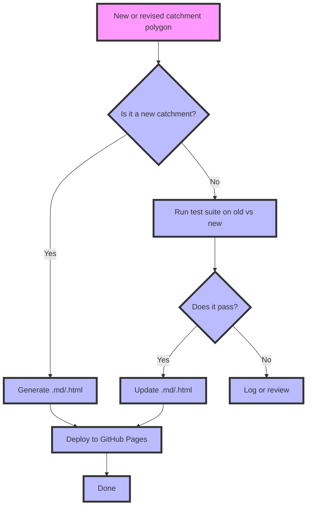

# Camel Farrier: Version Control for Catchment Polygons

## Overview

This repository serves as a version control archive for catchment polygons used in hydrological models. Each streamflow monitoring location is associated with a unique catchment polygon, which is stored in a GeoJSON format in its own folder. The repository allows for the addition of new catchments and revisions to existing ones.  A test suite is included to validate the geometry of the polygons and ensure that they meet the required standards, and to quantify the differences between the old and new polygons in terms of catchment attribute indices commonly found in the hydrological literature. The repository is designed to be user-friendly, with a focus on ease of use for contributors and reviewers.  Each streamflow monitoring location in the repository has its own folder with the following contents:

- **Geometric Data:** GeoJSON files representing catchment boundaries.
- **Attribute Data:** CSV files with relevant metadata.
- **Visualizations:** Plots and images of the catchment polygons.

A custom Python script generates individual pages for each catchment revision and a central index page with search functionality. The site is built using Jupyter Book.

## Catchment Polygon Update/Validation Workflow


```mermaid
flowchart TD
    A[New or revised catchment polygon] --> B{Is it a new catchment?}
    B -->|Yes| C[Generate .md/.html]
    B -->|No| D[Run test suite on old vs new]
    D --> E{Does it pass?}
    E -->|Yes| F[Update .md/.html]
    E -->|No| G[Log or review]
    F --> H[Deploy to GitHub Pages]
    C --> H
    H --> I[Done]
    style A fill:#f9f,stroke:#333,stroke-width:4px
    style B fill:#bbf,stroke:#333,stroke-width:4px
    style C fill:#bbf,stroke:#333,stroke-width:4px
    style D fill:#bbf,stroke:#333,stroke-width:4px
    style E fill:#bbf,stroke:#333,stroke-width:4px
    style F fill:#bbf,stroke:#333,stroke-width:4px
    style G fill:#bbf,stroke:#333,stroke-width:4px
    style H fill:#bbf,stroke:#333,stroke-width:4px
    style I fill:#bbf,stroke:#333,stroke-width:4px
```
<!-- ```mermaid
            ┌─────────┐
            │ geojson │
            └───┬─────┘
                ▼
     ┌──────────────────────────┐
     │ validate required fields │
     └────┬─────────────────────┘
          ▼
┌───────> does Official_ID exist?
│            │
│         ┌──┴───┐
│         │ No   │─────────► generate .md + .html (new catchment)
│         └──────┘
│            |
│         ┌──────┐
│         │ Yes  │
│         └──┬───┘
│            ▼
│   run test suite on old vs new
│            │
│       Pass / Fail
│            │
│   (optional: log or review)
│            │
└────────► update .md/.html -->


## 📦 Repository Structure (Relevant Parts)

This repository supports version-controlled updates to catchment boundaries using a standardized review process. Contributors can propose **new or revised catchment geometries** and automatically run spatial tests to validate their changes before integration.

| .           # Project root
├── book_docs/
|   └── _static/catchments/
|       └── 01AE001_catchment_plot.html  # Auto-generated Bokeh plot for each catchment
|   └── catchments/
│       └── HYDAT-01AE001/               # Example catchment folder 
│           ├── 01AE001_attributes.csv   # Corresponding metadata
│           ├── 01AE001.geojson          # Geometry file
│           └── 01AE001.md               # Markdown page for the catchment 
├── setup_scripts/                       # scripts for initializing the repository using the basis polygons (HYSETS)
├── templates/
│   ├── catchment_page_template_md.j2    # Jinja template for catchment pages
│   └── intro_content.md                 # Content for the introduction page
├── data/
│   ├── HYSETS_watershed_boundaries/     # Catchment polygons from HYSETS (baseline)
├── input_data/                      # Place new submissions here
| tests.py                               # Python test suite for validating catchment updates 
---


## Step-by-Step Guide: Testing New or Revised Polygons

### 1. Create a new branch

Create a new branch to work on your changes. This helps keep the main branch clean and allows for easier collaboration.

```bash
git checkout -b feature/update-catchment-<unique_id>
```

### 2. Save new geometry with metadata

Place the new or revised catchment polygon in the `input_data/` directory:

```bash
$ mkdir -p input_data/01AE001/
$ cp your_file.geojson input_data/01AE001/01AE001.geojson
$ cp your_metadata.csv input_data/01AE001/01AE001_attributes.csv
```

new_geometries.geojson → must contain valid geometries, 

The metadata in the (geojson) must include at least Official_ID, Source, and Name as columns.  `Official_ID` is the unique identifier of the monitoring station, the `Source` is the governing body responsible operating the monitoring station, and the `Name` of the station typically contains a name and a hydrographic reference to help locate the station, i.e. "*Chilcotin River below Big Creek*". 

### 3. Run the test suite on the proposed geometry

This project includes a test suite powered by [pytest](https://docs.pytest.org/), covering geometry validation, file structure checks, and other core utilities.  Testing geospatial functionality, you'll also requires `>pip install geopandas pyogrio shapely`:

### 4. Run all tests (can be multiple files)

```bash
pytest
```

### 5. Run specific tests within the tests.py file
```bash
pytest tests/test_precheck.py::test_precheck_accepts_valid_geojson
```

### ✅ Requirements

Make sure you have `pytest` installed:

```bash
pip install pytest

Use the test runner script to validate the proposed catchment update:

```bash
python tests.py \
  --geojson input_data/new_geometry.geojson 
```

The test suite will check for the following:
- **Geometry Validity:** Ensure the geometry is valid and does not contain any errors.
- **Field Completeness:** Check that all required fields are present in the metadata.
- **New or existing monitoring station catchment polygon:**  
  - If the `Official_ID` exists in the repository, it will compare the new geometry with the existing one.  The set of comparisons 
  - If the `Official_ID` does not exist, it will treat it as a new catchment and generate a new page. 

## Deployment to GitHub Pages

To deploy this repository to GitHub Pages, follow the steps detailed in `setup_scripts/update_catchment_pages_and_intro.py`. This script will automatically generate the necessary HTML files and update the index page.